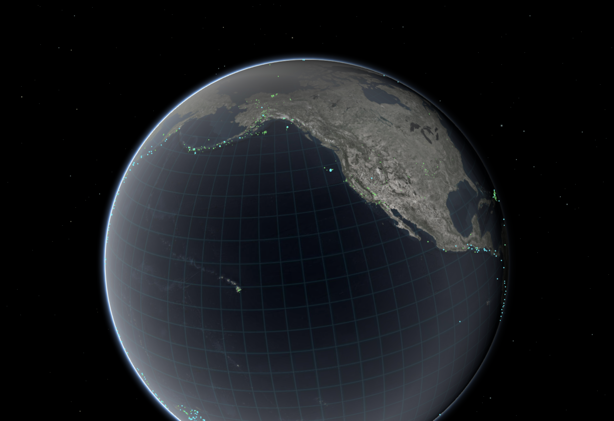
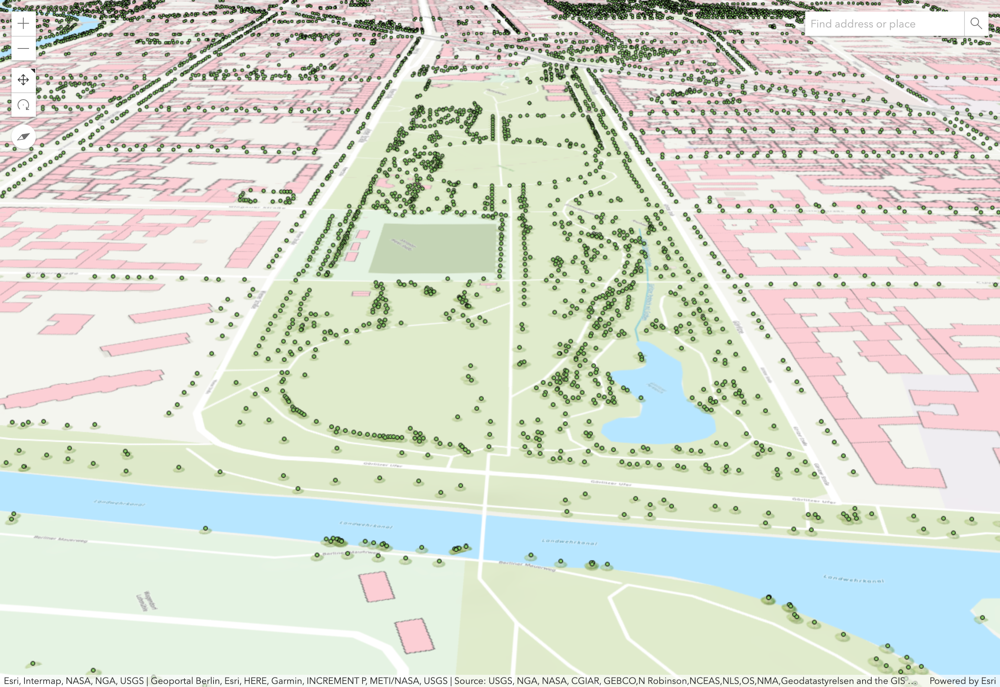
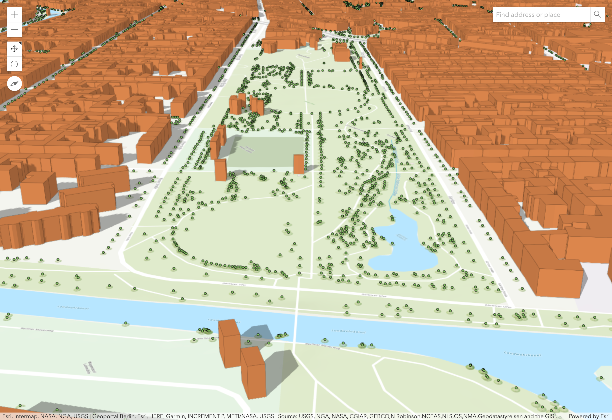
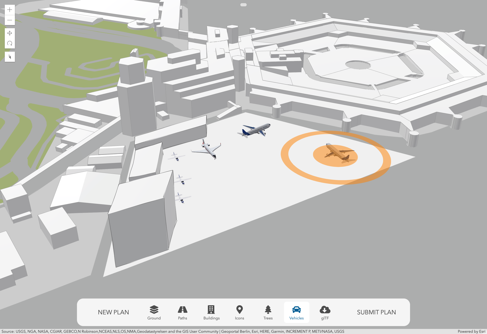

<!-- .slide: data-background="images/bg-4.png"  data-background-size="cover" -->

### Building Interactive 3D Web Apps Using Open Data

Jochen Manegold, Esri Germany \
Arno Fiva, Esri R&D Center Zürich

Note: Intro

---

<!-- .slide: data-background="images/bg-4.png"  data-background-size="cover" -->

## Earthquakes

---

<!-- .slide: data-background="images/bg-2.png"  data-background-size="cover" -->

Visualize

---

<!-- .slide: data-background="images/bg-2.png"  data-background-size="cover" -->

Client-side Queries

---

<!-- .slide: data-background="images/bg-4.png"  data-background-size="cover" -->

## City Visualizations

---

<!-- .slide: data-background="images/bg-2.png"  data-background-size="cover" -->

2D Data

---

<!-- .slide: data-background="images/bg-2.png"  data-background-size="cover" -->

Extrude Buildings

---

<!-- .slide: data-background="images/bg-2.png"  data-background-size="cover" -->

Use WebStyle Symbols

---

<!-- .slide: data-background="images/bg-2.png"  data-background-size="cover" -->

Extrude Building Heights

---

<!-- .slide: data-background="images/bg-4.png"  data-background-size="cover" -->

## 3D Building Models

---

<!-- .slide: data-background="images/bg-2.png"  data-background-size="cover" -->

Airport Sketch

