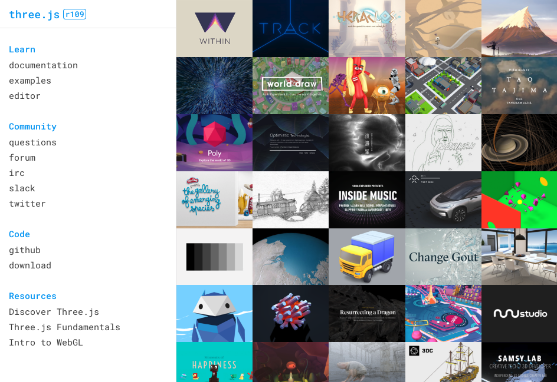

<!-- .slide: data-background="images/bg-1.png" data-title="add-scene-layer" class="title" -->

# ArcGIS API for JavaScript Using Animations

Yannik Messerli, Esri R&D Center Zürich \
Arno Fiva, Esri R&D Center Zürich

ESRI EUROPEAN DEVELOPER SUMMIT​

---

<!-- .slide: data-background="images/bg-4.png" data-title="add-scene-layer" data-state="slide-animation-title" data-transition="zoom-in slide-out" -->

<h1 id="animation" style="font-size: 500%;">Animation</h1>

Successive drawings to create an illusion of movement.

---

<!-- .slide: data-background="images/bg-2.png" data-title="add-scene-layer" data-transition="fade" -->

Animate UI elements

Animate the Camera

Animate Scene's elements
    <ul style="font-size: 0.7em;">
    <li class="fragment fade-in">Visual properties <em style="opacity: 0.8; font-weight: normal;font-size: 80%;">(colors, positions, ...)</em></li>
    <li class="fragment fade-in">3D environment properties</li>
    <li class="fragment fade-in">3D geometries</small></li>
    <li class="fragment fade-in" style="opacity: 0.8; font-weight: normal;">3D texture</li>
</ul>

---

<!-- .slide: data-background="images/bg-3.png" data-title="add-scene-layer" -->

### Agenda

1. Built-in API Capabilities
2. Custom Animations
  * Pure Javascript's Techniques
  * Animation Libraries
  * Interpolation
  * Smooth Lines
3. External renderer

---

<!-- .slide: data-background="images/bg-3.png" data-title="add-scene-layer" -->

<h1 style="font-size: 500%;border: 5px solid white; border-radius: 100%;     width: 220px;height: 100px;padding-bottom: 120px; margin: auto; margin-bottom: 50px; box-shadow:1px 1px 1px #919191, 1px 2px 1px #919191, 1px 3px 1px #919191, 1px 4px 1px #919191, 1px 5px 1px #919191, 1px 6px 1px #919191, 1px 7px 1px #919191, 1px 8px 1px #919191, 1px 9px 1px #919191, 1px 10px 1px #919191, 1px 18px 6px rgba(16,16,16,0.4), 1px 22px 10px rgba(16,16,16,0.2), 1px 25px 35px rgba(16,16,16,0.2), 1px 30px 60px rgba(16,16,16,0.4);background: radial-gradient(circle, rgba(0,0,0,0) 50%, rgba(0,0,0,1) 100%);" class="letter3d number appear">1</h1>

<h1 id="built-in-api-capabilities" style="text-shadow: 2px 5px 15px rgba(0,0,0,0.5);">Built-in API capabilities</h1>

---

<!-- .slide: data-background="images/bg-2.png" data-title="add-scene-layer" data-transition="fade"-->

view.goTo()

---

<!-- .slide: data-background="images/bg-2.png" data-title="add-scene-layer" data-transition="fade"-->

view.goTo(<code style="font-size: 100%;">target</code>)

    <code style="font-size: 100%;" class="fragment">[lon, lat]</code> 
    <code style="font-size: 100%;" class="fragment">Camera</code> 
    <code style="font-size: 100%;" class="fragment">Geometry</code> 
    <code style="font-size: 100%;" class="fragment">Graphic</code> 
    <code style="font-size: 100%;">scale</code>, <code style="font-size: 100%;">center</code>, <code style="font-size: 100%;">position (camera)</code>, <code style="font-size: 100%;">heading</code> or <code style="font-size: 100%;">tilt</code>

---

<!-- .slide: data-background="images/bg-2.png" data-title="add-scene-layer" data-transition="fade-in zoom-out"-->

view.goTo(<code style="font-size: 100%;">target</code>).then(...)

    <code style="font-size: 100%;">[lon, lat]</code> 
    <code style="font-size: 100%;">Camera</code> 
    <code style="font-size: 100%;">Geometry</code> 
    <code style="font-size: 100%;">Graphic</code> 
    <code style="font-size: 100%;">scale</code>, <code style="font-size: 100%;">center</code>, <code style="font-size: 100%;">position (camera)</code>, <code style="font-size: 100%;">heading</code> or <code style="font-size: 100%;">tilt</code>

---

<!-- .slide: data-background="images/bg-3.png" data-title="add-scene-layer" data-transition="fade-in"-->

## A promise

      <pre><code class="lang-ts hljs typescript" style="padding: 20px;width: 100%;">
Promise.then(function (data) {
    // when it goes well...
}, function (error) {
    // when it is rejected...
});
</code></pre>

---

<!-- .slide: data-background="images/bg-3.png" data-title="add-scene-layer" -->

## [`SceneView.goTo`](https://developers.arcgis.com/javascript/beta/api-reference/esri-views-SceneView.html#goTo) &mdash; `heading`/`tilt`

  

    

      <pre><code class="lang-ts hljs typescript" style="padding: 20px;width: 100%;">
const currentHeading = view.camera.heading;
// Set the heading of the view to
// the closest multiple of 30 degrees
const heading = Math.floor((currentHeading + 1) / 30)
    \* 30 + 30;
// go to heading preserves view.center
view.goTo({
  heading
});
        </code>
    </pre>
      <svg data-play-frame="frame-go-to-heading-tilt" class="play-code" data-play-argument="heading" viewBox="0 0 24 24"><path fill="#999" d="M12,20.14C7.59,20.14 4,16.55 4,12.14C4,7.73 7.59,4.14 12,4.14C16.41,4.14 20,7.73 20,12.14C20,16.55 16.41,20.14 12,20.14M12,2.14A10,10 0 0,0 2,12.14A10,10 0 0,0 12,22.14A10,10 0 0,0 22,12.14C22,6.61 17.5,2.14 12,2.14M10,16.64L16,12.14L10,7.64V16.64Z" /></svg>
    

    

      <pre><code class="lang-ts hljs typescript" style="padding: 20px;">
const currentTilt = view.camera.tilt;
// Cycle tilt of the view in 15 degree increments
const tilt = (Math.floor((currentTilt + 1) / 15) * 15 + 15) % 90;
// go to tilt preserves view.center
view.goTo({
  tilt
});</code></pre>
      <svg data-play-frame="frame-go-to-heading-tilt" class="play-code" data-play-argument="tilt" viewBox="0 0 24 24"><path fill="#999" d="M12,20.14C7.59,20.14 4,16.55 4,12.14C4,7.73 7.59,4.14 12,4.14C16.41,4.14 20,7.73 20,12.14C20,16.55 16.41,20.14 12,20.14M12,2.14A10,10 0 0,0 2,12.14A10,10 0 0,0 12,22.14A10,10 0 0,0 22,12.14C22,6.61 17.5,2.14 12,2.14M10,16.64L16,12.14L10,7.64V16.64Z" /></svg>
    

  

  

    <iframe id="frame-go-to-heading-tilt" data-src="./samples/using-animations/04-go-to-heading-tilt.html" style="overflow: hidden;padding: 0; min-width: 400px;" frameborder="0"></iframe>
  

---

## GoTo - options

TBD

---

<!-- .slide: data-background-iframe="./samples/using-animations/03-water.html"-->

## [`WaterSymbol3DLayer`](https://developers.arcgis.com/javascript/latest/api-reference/esri-symbols-WaterSymbol3DLayer.html)

  
Wave direction

    <input
      type="range"
      name="waveDirection"
      value="50"
      min="0"
      max="360"
      id="direction"
      onchange="document.querySelector('.slide-background.present iframe').contentWindow.postMessage({ play: true, direction: this.value }, '*');"
    />
    
Wave strength

    

      <input
        type="radio"
        name="waveStrengthRadio"
        value="calm"
        id="calm"
        onchange="document.querySelector('.slide-background.present iframe').contentWindow.postMessage({ play: true, strength: this.value }, '*');"
      /><label for="calm">Calm</label> 
      <input
        type="radio"
        name="waveStrengthRadio"
        value="rippled"
        id="rippled"
        onchange="document.querySelector('.slide-background.present iframe').contentWindow.postMessage({ play: true, strength: this.value }, '*');"
      /><label for="rippled">Rippled</label> 
      <input
        type="radio"
        name="waveStrengthRadio"
        value="slight"
        id="slight"
        onchange="document.querySelector('.slide-background.present iframe').contentWindow.postMessage({ play: true, strength: this.value }, '*');"
      /><label for="slight">Slight</label> 
      <input
        type="radio"
        name="waveStrengthRadio"
        value="moderate"
        id="moderate"
        onchange="document.querySelector('.slide-background.present iframe').contentWindow.postMessage({ play: true, strength: this.value }, '*');"
        checked
      /><label for="moderate">Moderate</label> 
    

    
Dominant color

    <button id="navy" class="color-btn" onclick="document.querySelector('.slide-background.present iframe').contentWindow.postMessage({ play: true, color: '#25427c' }, '*');"></button>
    <button id="green" class="color-btn" onclick="document.querySelector('.slide-background.present iframe').contentWindow.postMessage({ play: true, color: '#039962' }, '*');"></button>
    <button id="turqoise" class="color-btn" onclick="document.querySelector('.slide-background.present iframe').contentWindow.postMessage({ play: true, color: '#a2f9f5' }, '*');"></button>

---

<!-- .slide: data-background="images/bg-3.png" data-title="add-scene-layer" -->

<h1 style="font-size: 500%;border: 5px solid white; border-radius: 100%;     width: 220px;height: 100px;padding-bottom: 120px; margin: auto; margin-bottom: 50px; box-shadow:1px 1px 1px #919191, 1px 2px 1px #919191, 1px 3px 1px #919191, 1px 4px 1px #919191, 1px 5px 1px #919191, 1px 6px 1px #919191, 1px 7px 1px #919191, 1px 8px 1px #919191, 1px 9px 1px #919191, 1px 10px 1px #919191, 1px 18px 6px rgba(16,16,16,0.4), 1px 22px 10px rgba(16,16,16,0.2), 1px 25px 35px rgba(16,16,16,0.2), 1px 30px 60px rgba(16,16,16,0.4);background: radial-gradient(circle, rgba(0,0,0,0) 50%, rgba(0,0,0,1) 100%);" class="letter3d number appear">2</h1>

<h1 id="custom-animation" style="text-shadow: 2px 5px 15px rgba(0,0,0,0.5);">Custom animation</h1>

---

<!-- .slide: data-background="images/bg-3.png" data-title="add-scene-layer" -->

In this section, the idea is to...

### Update _some_ parameters at a defined time steps

using pure Javascript or libraries.

---

<!-- .slide: data-background="images/bg-3.png" data-title="add-scene-layer" -->

### Agenda

<ol>
  <li style="opacity: 0.3;">Built-in API Capabilities</li>
  <li>Custom Animations
  <ul>
    <li>Pure Javascript's Techniques</li>
    <li style="opacity: 0.3;">Animation Libraries</li>
    <li style="opacity: 0.3;">Interpolation</li>
    <li style="opacity: 0.3;">Smooth Lines</li>
  </ul>
  </li>
  <li style="opacity: 0.3;">External renderer</li>
</ol>

---

<!-- .slide: data-background="images/bg-3.png" data-title="add-scene-layer" -->

    

        Let's change the lighting manually...   
        

            <pre>
            <code style="padding: 50px;" class="lang-js">
    const now = new Date();
     
    function nextStep() {
        now.setHours(now.getHours() + 1);
        view.environment.lighting.date = now;
    }
            </code></pre>
            <svg data-play-frame="daylight-click" class="play-code" viewBox="0 0 24 24"><path fill="#999" d="M12,20.14C7.59,20.14 4,16.55 4,12.14C4,7.73 7.59,4.14 12,4.14C16.41,4.14 20,7.73 20,12.14C20,16.55 16.41,20.14 12,20.14M12,2.14A10,10 0 0,0 2,12.14A10,10 0 0,0 12,22.14A10,10 0 0,0 22,12.14C22,6.61 17.5,2.14 12,2.14M10,16.64L16,12.14L10,7.64V16.64Z" /></svg>
        

    

    

      <iframe id="daylight-click" data-src="./samples/using-animations/01-snippet-daylight-click.html" scrolling="no" style="overflow: hidden;padding: 0; min-width: 400px;" frameborder="0"></iframe>
    

---

<!-- .slide: data-background="images/bg-3.png" data-title="add-scene-layer" -->

Using built-in timing functions:

        <pre>
            <code style="padding: 0px 50px;" class="lang-js">
...
setInterval(nextStep, 200);
            </code>
        </pre>
    

Or...

        <pre>
            <code style="padding: 0px 50px;" class="lang-js">
function nextStep() {
    ...
    setTimeout(nextStep, 0);
}
setTimeout(nextStep, 0);
            </code>
        </pre>
    

---

<!-- .slide: data-background="images/bg-3.png" data-title="add-scene-layer" -->

### Limitations

<!-- Inspiration: https://vimeo.com/254947206 -->

- `nextStep` can be called multiple time before the browser renders one frame
- It will waste CPU time
- Animation can look chopy if called less time than browser renders frames

---

<!-- .slide: data-background="images/bg-3.png" data-title="add-scene-layer" -->

### `requestAnimationFrame`

<!-- inspiration: https://flaviocopes.com/requestanimationframe/
    https://css-tricks.com/using-requestanimationframe/
    https://developer.mozilla.org/en-US/docs/Web/API/window/requestAnimationFrame -->

> It's a function provided by the browser for it to call your function (likely to update an animation) before the next **repaint**.

<small>source: <a href="https://developer.mozilla.org/en-US/docs/Web/API/window/requestAnimationFrame">https://developer.mozilla.org</a></small>

---

<!-- .slide: data-background="images/bg-3.png" data-title="add-scene-layer" -->

### In code...

    

        

            <pre>
            <code style="padding: 0" class="lang-js">
                   
    ...
    const startTime = new Date().getTime();
     
    function nextStep(timestamp) {
        // epoch time [ms] (floated precision):
        const elapsedTime = startTime - timestamp;
        ...
        // request next refresh:
        window.requestAnimationFrame(nextStep);
    }
    // start:
    window.requestAnimationFrame(nextStep);
     
     
     
            </code></pre>
            <svg data-play-frame="daylight-animation" class="play-code" viewBox="0 0 24 24"><path fill="#999" d="M12,20.14C7.59,20.14 4,16.55 4,12.14C4,7.73 7.59,4.14 12,4.14C16.41,4.14 20,7.73 20,12.14C20,16.55 16.41,20.14 12,20.14M12,2.14A10,10 0 0,0 2,12.14A10,10 0 0,0 12,22.14A10,10 0 0,0 22,12.14C22,6.61 17.5,2.14 12,2.14M10,16.64L16,12.14L10,7.64V16.64Z" /></svg>
        

    

    

      <iframe id="daylight-animation" data-src="./samples/using-animations/02-snippet-daylight-animation.html" scrolling="no" style="overflow: hidden;padding: 0; min-width: 600px;margin-top: 0;" frameborder="0"></iframe>
    

---

<!-- .slide: data-background="images/bg-3.png" data-title="add-scene-layer" -->

### Controlling animation speed...

        <pre>
            <code style="padding: 20px 50px;" class="lang-js">
const elapsedTime = startTime - currentTimestamp;
 
// project to your position coordinate:
const step = velocity * elapsedTime;
 
// update at position x:
updateAnimationAt(step);
            </code>
        </pre>
    

---

<!-- .slide: data-background="images/bg-3.png" data-title="add-scene-layer" -->

### Agenda

<ol>
  <li style="opacity: 0.3;">Built-in API Capabilities</li>
  <li>Custom Animations
  <ul>
    <li style="opacity: 0.3;">Pure Javascript's Techniques</li>
    <li>Animation Libraries</li>
    <li style="opacity: 0.3;">Interpolation</li>
    <li style="opacity: 0.3;">Smooth Lines</li>
  </ul>
  </li>
  <li style="opacity: 0.3;">External renderer</li>
</ol>

---

<!-- .slide: data-background="images/bg-3.png" data-title="add-scene-layer" -->

## Animation Libraries

[https://animejs.com/](https://animejs.com/) <!-- .element: class="fragment" -->

<iframe src="https://animejs.com" class="fragment">

---

<!-- .slide: data-background="images/bg-2.png" data-title="add-3d-symbol" -->

## Animation Libraries

Easing Functions

[Hands-On Design Patterns with React Native by Mateusz Grzesiukiewicz](https://www.oreilly.com/library/view/hands-on-design-patterns/9781788994460/90627016-f8d5-4adc-98d1-7b4e667f33ae.xhtml)

---

<!-- .slide: data-background="images/bg-2.png" data-title="add-3d-symbol" -->

## Animation Libraries

3D Point Symbols

  

<pre><code class="lang-ts">
var point = new Point({
  latitude: 52.5557, // Approach Berlin Tegel
  longitude: 13.2667,
  z: 100,
});

var symbol = new WebStyleSymbol({
  name: "Airplane_Large_Passenger_With_Wheels",
  styleName: "EsriRealisticTransportationStyle",
});

var plane = new Graphic({
  geometry: point,
  symbol: symbol,
});

graphicsLayer.add(plane);
</code></pre>

  

  

    <iframe id="go-to-demo" data-src="./samples/berlin-airport" ></iframe>
  

---

<!-- .slide: data-background="images/bg-2.png" data-title="animate-3d-symbol" -->

## Animation Libraries

Translation & Easing

  

<pre><code class="lang-ts">var timeline = anime.timeline({
  autoplay: false,
  targets: point,
  loop: true,
  duration: 5000,
  update: function() {
    plane.geometry = point.clone();
  }
});</code></pre>

<pre><code class="lang-ts">timeline.add({
  latitude: 52.5572, longitude: 13.2816,
  easing: "linear",
})
.add({
  z: 0,
  easing: "easeOutSine",
}, 0)
.add({
  latitude: 52.5584, longitude: 13.2930,
  easing: "easeOutSine",
});</code></pre>

  

  

    <iframe id="go-to-demo" data-src="./samples/berlin-airport" ></iframe>
  

---

<!-- .slide: data-background="images/bg-3.png" data-title="add-scene-layer" -->

### Agenda

<ol>
  <li style="opacity: 0.3;">Built-in API Capabilities</li>
  <li>Custom Animations
  <ul>
    <li style="opacity: 0.3;">Pure Javascript's Techniques</li>
    <li style="opacity: 0.3;">Animation Libraries</li>
    <li>Interpolation</li>
    <li style="opacity: 0.3;">Smooth Lines</li>
  </ul>
  </li>
  <li style="opacity: 0.3;">External renderer</li>
</ol>

---

<!-- .slide: data-background="images/bg-2.png" data-title="generalize-wall" -->

### Linear Interpolation

Generalize Geometry

  

<pre><code class="lang-ts">layer.queryFeatures(query)</code></pre>

<pre><code class="lang-ts">// Retrieve list of geometries
.then(response => response.features.map(f => f.geometry))</code></pre>

<pre><code class="lang-ts">// Create single geometry
.then(geometries => geometryEngine.union(geometries))</code></pre>

<pre><code class="lang-ts">// Generalize by deviating max 2.5km from original geometry
.then(wall => geometryEngine.generalize(wall, 2500))</code></pre>

<button class="play" id="generalizeWallPoints"></button>
<pre><code class="lang-ts">.then(simpleWall => draw(simpleWall));</code></pre>

  

  

    <iframe id="berlin-wall-camera-path-generalize" data-src="./samples/berlin-wall-camera-path/generalize" ></iframe>
  

---

<!-- .slide: data-background="images/bg-2.png" data-title="generalize-wall" -->

### Linear Interpolation

Some 2D Math

  

<pre><code class="lang-ts">// Distance between two points, alternatively use
// geometryEngine.geodesicLength()
// geometryEngine.planarLength()
function dist(pointA, pointB) {
  const a = pointA.x - pointB.x;
  const b = pointA.y - pointB.y;
  return Math.sqrt(a * a + b * b);
}</code></pre>

<pre><code class="lang-ts">// Degrees looking from pointA to pointB
function heading(pointA, pointB) {
  const atan2 = Math.atan2(
    pointB.y - pointA.y,
    pointB.x - pointA.x
  );
  return 90 - atan2 * 180 / Math.PI;
}</code></pre>

  

  

<pre><code class="lang-ts">// Interpolate between points
function lerp2D(pointA, pointB, t) {
  var point = pointA.clone();
  point.x = pointA.x + (pointB.x - pointA.x ) * t;
  point.y = pointA.y + (pointB.y - pointA.y) * t;
  return point;
}</code></pre>

  

---

<!-- .slide: data-background="images/bg-2.png" data-title="update-camera" -->

### Linear Interpolation

Update Camera

  

<pre><code class="lang-ts">// Animation
totalTime = ...; // time for segment
initialDist = ...; // distance between camera and wall
function step(timestamp) {
  var t = (timestamp - startTime) / totalTime;
  var camera = view.camera.clone();</code></pre>

<pre><code class="lang-ts">  // Point we are following
  var target = lerp2D(pointA, pointB, t);
  var d = 1 - initialDist / dist(camera.position, target);</code></pre>

<button class="play" id="animateWall"></button>
<pre><code class="lang-ts">  // New camera position
  camera.position = lerp2D(camera.position, target, d);
  camera.heading = heading(camera.position, target);
  view.camera = camera;
  requestAnimationFrame(step);
};
requestAnimationFrame(step);</code></pre>

  

  

    <iframe id="berlin-wall-camera-path-generalize" data-src="./samples/berlin-wall-camera-path/generalize" ></iframe>
  

---

<!-- .slide: data-background="images/bg-4.png" data-title="add-scene-layer" -->

### Agenda

<ol>
  <li style="opacity: 0.3;">Built-in API Capabilities</li>
  <li>Custom Animations
  <ul>
    <li style="opacity: 0.3;">Pure Javascript's Techniques</li>
    <li style="opacity: 0.3;">Animation Libraries</li>
    <li style="opacity: 0.3;">Interpolation</li>
    <li>Smooth Lines</li>
  </ul>
  </li>
  <li style="opacity: 0.3;">External renderer</li>
</ol>

---

<!-- .slide: data-background="images/bg-2.png" data-title="add-scene-layer" -->

## Sailing Route

<iframe data-src="./samples/cycladecontours" class="fragment">

---

<!-- .slide: data-background="images/bg-3.png" data-title="add-scene-layer" -->

<h1 style="font-size: 500%;border: 5px solid white; border-radius: 100%;     width: 220px;height: 100px;padding-bottom: 120px; margin: auto; margin-bottom: 50px; box-shadow:1px 1px 1px #919191, 1px 2px 1px #919191, 1px 3px 1px #919191, 1px 4px 1px #919191, 1px 5px 1px #919191, 1px 6px 1px #919191, 1px 7px 1px #919191, 1px 8px 1px #919191, 1px 9px 1px #919191, 1px 10px 1px #919191, 1px 18px 6px rgba(16,16,16,0.4), 1px 22px 10px rgba(16,16,16,0.2), 1px 25px 35px rgba(16,16,16,0.2), 1px 30px 60px rgba(16,16,16,0.4);background: radial-gradient(circle, rgba(0,0,0,0) 50%, rgba(0,0,0,1) 100%);" class="letter3d number appear">3</h1>

<h1 id="custom-animation" style="text-shadow: 2px 5px 15px rgba(0,0,0,0.5);">External Renderer</h1>

---

<!-- .slide: data-background="images/bg-3.png" data-title="extending" -->

## When to use external renderers?

- You want to animate many scene's elements
- You are familiar with WebGL and can afford the development effort
- **Important disclaimer: Experimental!**
<!---

## Earthquakes (APL)

<video height="450px" autoplay="yes" controls="yes" loop="yes">
  <source data-src="./images/animations/earth-quakes.mp4" type="video/mp4"/>
</video>

https://github.com/richiecarmichael/Esri-Quake-Map

--->

---

## NYC Crime Trend

<iframe id="frame-velocity-flow" data-src="http://coolmaps.esri.com/Dashboards/CrimeTrends"></iframe>

---

## Basic concepts

<!-- https://developers.arcgis.com/javascript/latest/api-reference/esri-views-3d-externalRenderers.html -->

<pre style="font-size: 0.8em"><code class="lang-js hljs typescript">
require([
  "esri/views/3d/externalRenderers"
], function(externalRenderers) {
  var myExternalRenderer = {
    setup: function(context) {
      // Executed once after the external renderer is added to a view.
    },
    render: function(context) {
      // Executed in every frame to draw geometry to the canvas:
      // * Update the state of dynamic resources
      // * Set the WebGL state as needed for rendering
      // * Issue WebGL draw calls
    }
  };
  // ...
  externalRenderers.add(view, myExternalRenderer);
  // ...
});
</code></pre>

---

## Integration with three.js

- Working with pure WebGL can be cumbersome
- Use a higher level abstraction
- three.js is a popular 3D rendering library for WebGL

(https://threejs.org/)

---

## Hands-on, three.js &mdash; Animations

  

    <pre><code class="lang-ts hljs typescript" style="padding: 20px;width: 100%;">
const loader = new THREE.ColladaLoader();
 
loader.load("./model.dae", (m: any) => {
  for (const anim of m.animations) {
    const keyAnim = new THREE.KeyFrameAnimation(anim);
 
    keyAnim.loop = false;
    keyAnim.play(0);
 
    animations.push(keyAnim);
  }
});
 
// ...
 
animations.forEach(anim => anim.update(timestep));
    </code></pre>
    <svg data-play-frame="frame-threejs-loader-animations" class="play-code" viewBox="0 0 24 24"><path fill="#999" d="M12,20.14C7.59,20.14 4,16.55 4,12.14C4,7.73 7.59,4.14 12,4.14C16.41,4.14 20,7.73 20,12.14C20,16.55 16.41,20.14 12,20.14M12,2.14A10,10 0 0,0 2,12.14A10,10 0 0,0 12,22.14A10,10 0 0,0 22,12.14C22,6.61 17.5,2.14 12,2.14M10,16.64L16,12.14L10,7.64V16.64Z" /></svg>
  

  

    <iframe id="frame-threejs-loader-animations" data-src="https://jkieboom.github.io/devsummit-palm-springs-2017/extending-3d-engine/snippets/snippet.html?05-threejs-loader-animations" style="overflow: hidden;padding: 0; min-width: 400px; max-width: 80%; width: 80%; height" frameborder="0"></iframe>
  

---

## Demos

<iframe data-src="https://developers.arcgis.com/javascript/latest/sample-code/scene-external-renderer/live/index.html" frameborder="0"></iframe>

---

## Advanced animations:

<!-- http://coolmaps.esri.com/#13 -->

<iframe id="frame-velocity-flow" data-src="https://jkieboom.github.io/devsummit-palm-springs-2017/extending-3d-engine/snippets/snippet.html?07-velocity-flow&console=no"></iframe>

---

## Summary

---

<!-- .slide: data-background="images/bg-3.png" -->

Please Take Our Survey on the App

---

<!-- .slide: data-background="images/bg-final.png" -->
