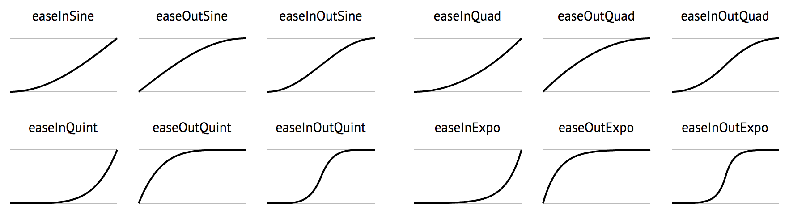
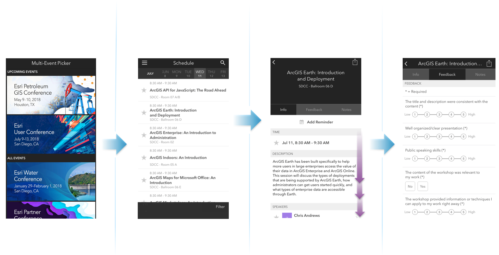

<!-- .slide: data-background="images/bg-1.png" data-title="add-scene-layer" class="title" -->

# ArcGIS API for JavaScript Using Animations

Yannik Messerli, Esri R&D Center Zürich \
Arno Fiva, Esri R&D Center Zürich

ESRI EUROPEAN DEVELOPER SUMMIT​

---

<!-- .slide: data-background="images/bg-3.png" data-title="add-scene-layer" -->

### Agenda

* 1. Built-in API Capabilities (Y)
  * `view.goTo()` / `slide.apply()`
  * Promises
  * Water
* 2. Custom Animations
  * `requestAnimationFrame()` (Y)
  * Animation Libraries
  * Interpolation
  * Smooth Lines
* 3. External renderer (Y)

---

<!-- .slide: data-background="images/bg-4.png" data-title="add-scene-layer" data-state="slide-animation-title" data-transition="zoom-in slide-out" -->

<h1 id="animation" style="font-size: 500%;">Animation</h1>

Successive drawings to create an illusion of movement.

---

<!-- .slide: data-background="images/bg-3.png" data-title="add-scene-layer" data-transition="fade" -->

### Type of animations:

<ul>
<li>Animate UI element (CSS) <small><em>not covered</em></small></li>
<li><strong>Animate camera</strong></li>
<li>Animate scene's elements
    <ul>
    <li class="fragment"><strong>Visual properties <em>(colors, positions, ...)</em></strong></li>
    <li class="fragment">3D texture <small><em>not covered</em></small></li>
    <li class="fragment"><strong>3D environment properties</strong></li>
    <li class="fragment">3D geometries <small><em>partially covered</em></small></li>
    <li class="fragment"><strong>Full 3D animations</strong> <small><em>extension</em></small></li>
</ul>
</li>
</ul>

---

<!-- .slide: data-background="images/bg-3.png" data-title="add-scene-layer" -->

<h1 style="font-size: 500%;border: 5px solid white; border-radius: 100%;     width: 220px;height: 100px;padding-bottom: 120px; margin: auto; margin-bottom: 50px; box-shadow:1px 1px 1px #919191, 1px 2px 1px #919191, 1px 3px 1px #919191, 1px 4px 1px #919191, 1px 5px 1px #919191, 1px 6px 1px #919191, 1px 7px 1px #919191, 1px 8px 1px #919191, 1px 9px 1px #919191, 1px 10px 1px #919191, 1px 18px 6px rgba(16,16,16,0.4), 1px 22px 10px rgba(16,16,16,0.2), 1px 25px 35px rgba(16,16,16,0.2), 1px 30px 60px rgba(16,16,16,0.4);background: radial-gradient(circle, rgba(0,0,0,0) 50%, rgba(0,0,0,1) 100%);" class="letter3d number appear">1</h1>

<h1 id="built-in-api-capabilities" style="text-shadow: 2px 5px 15px rgba(0,0,0,0.5);">Built-in API capabilities</h1>

---

<!-- .slide: data-background="images/bg-2.png" data-title="add-scene-layer" data-transition="fade"-->

view.goTo()

---

<!-- .slide: data-background="images/bg-2.png" data-title="add-scene-layer" data-transition="fade"-->

view.goTo(<code style="font-size: 100%;">target</code>)

    <code style="font-size: 100%;" class="fragment">[lon, lat]</code> 
    <code style="font-size: 100%;" class="fragment">Camera</code> 
    <code style="font-size: 100%;" class="fragment">Geometry</code> 
    <code style="font-size: 100%;" class="fragment">Graphic</code> 
    <code style="font-size: 100%;">scale</code>, <code style="font-size: 100%;">center</code>, <code style="font-size: 100%;">position (camera)</code>, <code style="font-size: 100%;">heading</code> or <code style="font-size: 100%;">tilt</code>

---

<!-- .slide: data-background="images/bg-2.png" data-title="add-scene-layer" data-transition="fade-in zoom-out"-->

view.goTo(<code style="font-size: 100%;">target</code>).then(...)

    <code style="font-size: 100%;">[lon, lat]</code> 
    <code style="font-size: 100%;">Camera</code> 
    <code style="font-size: 100%;">Geometry</code> 
    <code style="font-size: 100%;">Graphic</code> 
    <code style="font-size: 100%;">scale</code>, <code style="font-size: 100%;">center</code>, <code style="font-size: 100%;">position (camera)</code>, <code style="font-size: 100%;">heading</code> or <code style="font-size: 100%;">tilt</code>

---

<!-- .slide: data-background="images/bg-3.png" data-title="add-scene-layer" data-transition="fade-in"-->

## A promise

      <pre><code class="lang-ts hljs typescript" style="padding: 20px;width: 100%;">
Promise.then(function (data) {
    // when it goes well...
}, function (error) {
    // when it is rejected...
});
</code></pre>

---

<!-- .slide: data-background="images/bg-3.png" data-title="add-scene-layer" -->

## [`SceneView.goTo`](https://developers.arcgis.com/javascript/beta/api-reference/esri-views-SceneView.html#goTo) &mdash; `heading`/`tilt`

  

    

      <pre><code class="lang-ts hljs typescript" style="padding: 20px;width: 100%;">
const currentHeading = view.camera.heading;
// Set the heading of the view to
// the closest multiple of 30 degrees
const heading = Math.floor((currentHeading + 1) / 30)
    \* 30 + 30;
// go to heading preserves view.center
view.goTo({
  heading
});
        </code>
    </pre>
      <svg data-play-frame="frame-go-to-heading-tilt" class="play-code" data-play-argument="heading" viewBox="0 0 24 24"><path fill="#999" d="M12,20.14C7.59,20.14 4,16.55 4,12.14C4,7.73 7.59,4.14 12,4.14C16.41,4.14 20,7.73 20,12.14C20,16.55 16.41,20.14 12,20.14M12,2.14A10,10 0 0,0 2,12.14A10,10 0 0,0 12,22.14A10,10 0 0,0 22,12.14C22,6.61 17.5,2.14 12,2.14M10,16.64L16,12.14L10,7.64V16.64Z" /></svg>
    

    

      <pre><code class="lang-ts hljs typescript" style="padding: 20px;">
const currentTilt = view.camera.tilt;
// Cycle tilt of the view in 15 degree increments
const tilt = (Math.floor((currentTilt + 1) / 15) * 15 + 15) % 90;
// go to tilt preserves view.center
view.goTo({
  tilt
});</code></pre>
      <svg data-play-frame="frame-go-to-heading-tilt" class="play-code" data-play-argument="tilt" viewBox="0 0 24 24"><path fill="#999" d="M12,20.14C7.59,20.14 4,16.55 4,12.14C4,7.73 7.59,4.14 12,4.14C16.41,4.14 20,7.73 20,12.14C20,16.55 16.41,20.14 12,20.14M12,2.14A10,10 0 0,0 2,12.14A10,10 0 0,0 12,22.14A10,10 0 0,0 22,12.14C22,6.61 17.5,2.14 12,2.14M10,16.64L16,12.14L10,7.64V16.64Z" /></svg>
    

  

  

    <iframe id="frame-go-to-heading-tilt" data-src="./samples/using-animations/04-go-to-heading-tilt.html" style="overflow: hidden;padding: 0; min-width: 400px;" frameborder="0"></iframe>
  

<!---

## [`SceneView.goTo`](https://developers.arcgis.com/javascript/beta/api-reference/esri-views-SceneView.html#goTo) &mdash; Continuous updates

    

      <pre><code class="lang-ts hljs typescript" style="padding: 20px; float: none; ">
function animateLookAroundStep() {
  view.goTo({
    position: animationPosition,
    heading: view.camera.heading - 0.1
  }, { animate: false });
}
 
function animateRotateAroundStep() {
  view.goTo({
    center: animationCenter,
    scale: animationScale,
    heading: view.camera.heading + 0.1
  }, { animate: false });
}
 
function startAnimation() {
  // Store scale, center and position to
  // animate around
  animationScale = view.scale;
  animationCenter = view.center.clone();
  animationPosition = view.camera.position.clone();
  animate();
}
</code></pre>
      <svg data-play-frame="frame-go-to-heading-continuous" class="play-code" viewBox="0 0 24 24"><path fill="#999" d="M12,20.14C7.59,20.14 4,16.55 4,12.14C4,7.73 7.59,4.14 12,4.14C16.41,4.14 20,7.73 20,12.14C20,16.55 16.41,20.14 12,20.14M12,2.14A10,10 0 0,0 2,12.14A10,10 0 0,0 12,22.14A10,10 0 0,0 22,12.14C22,6.61 17.5,2.14 12,2.14M10,16.64L16,12.14L10,7.64V16.64Z" /></svg>
    

  

    <iframe id="frame-go-to-heading-continuous" data-src="./samples/using-animations/05-go-to-heading-continuous.html" style="overflow: hidden;padding: 0; min-width: 400px;" frameborder="0"></iframe>
  

I realised that this already involves animation that we see in the next chapter, so this slide is irrelevant here.

-->
---

<!-- .slide: data-background="images/bg-3.png" data-title="add-scene-layer" -->

## [`SceneView.goTo`](https://developers.arcgis.com/javascript/beta/api-reference/esri-views-SceneView.html#goTo) &mdash; Graphics, query

  

    <pre><code class="lang-ts hljs typescript" style="padding: 20px;width: 100%;">
const query = new Query({
  definitionExpression: "ELEVATION > 90",
  returnGeometry: false,
  geometry: view.extent.clone(),
  outFields: [layer.objectIdField]
});
// Query features from the service
layer.queryFeatures(query)
.then((featureSet: FeatureSet) => {
  // Get all the feature object ids
  const objectIds = featureSet.features.map(
    feature => feature.attributes[layer.objectIdField]
  );
 
  // Query the graphics from the layer view
  const query = new Query({ objectIds });
  return layerView.queryFeatures(query);
})
.then((graphics: Graphic[]) => {
  // Finally, frame the graphics using goTo
  view.goTo(graphics, { speedFactor: 0.2 });
});
</code></pre>
 <svg data-play-frame="frame-go-to-graphics" class="play-code" viewBox="0 0 24 24"><path fill="#999" d="M12,20.14C7.59,20.14 4,16.55 4,12.14C4,7.73 7.59,4.14 12,4.14C16.41,4.14 20,7.73 20,12.14C20,16.55 16.41,20.14 12,20.14M12,2.14A10,10 0 0,0 2,12.14A10,10 0 0,0 12,22.14A10,10 0 0,0 22,12.14C22,6.61 17.5,2.14 12,2.14M10,16.64L16,12.14L10,7.64V16.64Z" /></svg>
  

  

    <iframe id="frame-go-to-graphics" data-src="./samples/using-animations/06-go-to-graphics.html" style="overflow: hidden;padding: 0; min-width: 400px;" frameborder="0"></iframe>
  

---

<!-- .slide: data-background="images/bg-3.png" data-title="add-scene-layer" -->

## [`SceneView.goTo`](https://developers.arcgis.com/javascript/beta/api-reference/esri-views-SceneView.html#goTo) &mdash; Graphics, hitTest

  

    <pre><code class="lang-ts hljs typescript" style="padding: 20px;width: 100%;">
   
view.on("double-click", (event: any) => {
  view.hitTest({ x: event.x, y: event. y})
      .then((hitResult: any) => {
        const graphic = (
          hitResult.results[0] &&
          hitResult.results[0].graphic
        );
 
        if (graphic) {
          const target = {
            target: graphic,
            scale: 1200,
            heading: view.camera.heading + 50
          };
 
          view.goTo(target, { speedFactor: 0.5 });
        }
      });
});
</code></pre>

  

    <iframe id="frame-go-to-graphics-hit-test" data-src="./samples/using-animations/07-go-to-graphics-hit-test.html" style="overflow: hidden;padding: 0; min-width: 400px;" frameborder="0"></iframe>
  

---

<!-- .slide: data-background-iframe="./samples/using-animations/03-water.html" data-transition="fade" -->

<iframe id="go-to-demo" data-src="./samples/using-animations/03-water.html" ></iframe>

## [`Water`](https://developers.arcgis.com/javascript/beta/api-reference/esri-views-SceneView.html#goTo)

---

<!-- .slide: data-background="images/bg-3.png" data-title="add-scene-layer" -->

<h1 style="font-size: 500%;border: 5px solid white; border-radius: 100%;     width: 220px;height: 100px;padding-bottom: 120px; margin: auto; margin-bottom: 50px; box-shadow:1px 1px 1px #919191, 1px 2px 1px #919191, 1px 3px 1px #919191, 1px 4px 1px #919191, 1px 5px 1px #919191, 1px 6px 1px #919191, 1px 7px 1px #919191, 1px 8px 1px #919191, 1px 9px 1px #919191, 1px 10px 1px #919191, 1px 18px 6px rgba(16,16,16,0.4), 1px 22px 10px rgba(16,16,16,0.2), 1px 25px 35px rgba(16,16,16,0.2), 1px 30px 60px rgba(16,16,16,0.4);background: radial-gradient(circle, rgba(0,0,0,0) 50%, rgba(0,0,0,1) 100%);" class="letter3d number appear">2</h1>

<h1 id="custom-animation" style="text-shadow: 2px 5px 15px rgba(0,0,0,0.5);">Custom animation</h1>

---

<!-- .slide: data-background="images/bg-3.png" data-title="add-scene-layer" -->

In this section, the idea is to...

### Update _some_ parameters at a defined time steps

using vanilla javascript or libraries.

---

<!-- .slide: data-background="images/bg-3.png" data-title="add-scene-layer" -->

    

        Let's change the lighting manually...   
        

            <pre>
            <code style="padding: 50px;" class="lang-js">
    const now = new Date();
     
    function nextStep() {
        now.setHours(now.getHours() + 1);
        view.environment.lighting.date = now;
    }
            </code></pre>
            <svg data-play-frame="daylight-click" class="play-code" viewBox="0 0 24 24"><path fill="#999" d="M12,20.14C7.59,20.14 4,16.55 4,12.14C4,7.73 7.59,4.14 12,4.14C16.41,4.14 20,7.73 20,12.14C20,16.55 16.41,20.14 12,20.14M12,2.14A10,10 0 0,0 2,12.14A10,10 0 0,0 12,22.14A10,10 0 0,0 22,12.14C22,6.61 17.5,2.14 12,2.14M10,16.64L16,12.14L10,7.64V16.64Z" /></svg>
        

    

    

      <iframe id="daylight-click" data-src="./samples/using-animations/01-snippet-daylight-click.html" scrolling="no" style="overflow: hidden;padding: 0; min-width: 400px;" frameborder="0"></iframe>
    

---

<!-- .slide: data-background="images/bg-3.png" data-title="add-scene-layer" -->

Using built-in timing functions:

        <pre>
            <code style="padding: 0px 50px;" class="lang-js">
...
setInterval(nextStep, 200);
            </code>
        </pre>
    

Or...

        <pre>
            <code style="padding: 0px 50px;" class="lang-js">
function nextStep() {
    ...
    setTimeout(nextStep, 0);
}
setTimeout(nextStep, 0);
            </code>
        </pre>
    

---

<!-- .slide: data-background="images/bg-3.png" data-title="add-scene-layer" -->

### Limitations

<!-- Inspiration: https://vimeo.com/254947206 -->

- `nextStep` can be called multiple time before the browser renders one frame
- It will waste CPU time
- Animation can look chopy if called less time than browser renders frames

---

<!-- .slide: data-background="images/bg-3.png" data-title="add-scene-layer" -->

### Solution: `requestAnimationFrame`

<!-- inspiration: https://flaviocopes.com/requestanimationframe/
    https://css-tricks.com/using-requestanimationframe/
    https://developer.mozilla.org/en-US/docs/Web/API/window/requestAnimationFrame -->

> It's a function provided by the browser for it to call your function (likeley to update an animation) before the next **repaint**.

<small>source: <a href="https://developer.mozilla.org/en-US/docs/Web/API/window/requestAnimationFrame">https://developer.mozilla.org</a></small>

---

<!-- .slide: data-background="images/bg-3.png" data-title="add-scene-layer" -->

### In code...

    

        

            <pre>
            <code style="padding: 0" class="lang-js">
                   
    ...
    const startTime = new Date().getTime();
     
    function nextStep(timestamp) {
        // epoch time [ms] (floated precision):
        const elapsedTime = startTime - timestamp;
        ...
        // request next refresh:
        window.requestAnimationFrame(nextStep);
    }
    // start:
    window.requestAnimationFrame(nextStep);
     
     
     
            </code></pre>
            <svg data-play-frame="daylight-animation" class="play-code" viewBox="0 0 24 24"><path fill="#999" d="M12,20.14C7.59,20.14 4,16.55 4,12.14C4,7.73 7.59,4.14 12,4.14C16.41,4.14 20,7.73 20,12.14C20,16.55 16.41,20.14 12,20.14M12,2.14A10,10 0 0,0 2,12.14A10,10 0 0,0 12,22.14A10,10 0 0,0 22,12.14C22,6.61 17.5,2.14 12,2.14M10,16.64L16,12.14L10,7.64V16.64Z" /></svg>
        

    

    

      <iframe id="daylight-animation" data-src="./samples/using-animations/02-snippet-daylight-animation.html" scrolling="no" style="overflow: hidden;padding: 0; min-width: 600px;margin-top: 0;" frameborder="0"></iframe>
    

---

<!-- .slide: data-background="images/bg-3.png" data-title="add-scene-layer" -->

### Tips & tricks

        <pre>
            <code style="padding: 20px 50px;" class="lang-js">
const elapsedTime = startTime - currentTimestamp;
 
// project to your position coordinate:
const step = velocity * elapsedTime;
 
// update at position x:
updateAnimationAt(step);
            </code>
        </pre>
    

---

<!-- .slide: data-background="images/bg-4.png" data-title="add-scene-layer" -->

# Custom Animations

## Animation Libraries

---

<!-- .slide: data-background="images/bg-3.png" data-title="add-scene-layer" -->

## Animation Libraries

[https://animejs.com/](https://animejs.com/) <!-- .element: class="fragment" -->

<iframe src="https://animejs.com/documentation/#loop" class="fragment">

---

<!-- .slide: data-background="images/bg-2.png" data-title="add-3d-symbol" -->

## Animation Libraries

Easing Functions

[Hands-On Design Patterns with React Native by Mateusz Grzesiukiewicz](https://www.oreilly.com/library/view/hands-on-design-patterns/9781788994460/90627016-f8d5-4adc-98d1-7b4e667f33ae.xhtml)

---

<!-- .slide: data-background="images/bg-2.png" data-title="add-3d-symbol" -->

## Animation Libraries

3D Point Symbols

  

<pre><code class="lang-ts">
var point = new Point({
  latitude: 52.55573101150287, // Approach Berlin Tegel
  longitude: 13.266720847998348,
});

var symbol = new WebStyleSymbol({
  name: "Airplane_Large_Passenger_With_Wheels",
  styleName: "EsriRealisticTransportationStyle",
});

var plane = new Graphic({
  geometry: point,
  symbol: symbol,
});

graphicsLayer.add(plane);
</code></pre>

  

  

    <iframe id="go-to-demo" data-src="./samples/berlin-airport" ></iframe>
  

---

<!-- .slide: data-background="images/bg-2.png" data-title="animate-3d-symbol" -->

## Animation Libraries

Translation & Easing

  

<pre><code class="lang-ts">point.z = 100;</code></pre>

<pre><code class="lang-ts">var timeline = anime.timeline({
  autoplay: false,
  targets: point,
  loop: true,
  duration: 5000,
  update: function() {
    plane.geometry = point.clone();
  }
});</code></pre>

<pre><code class="lang-ts">timeline.add({
  ...pointB,
  easing: "linear",
}).add({
  z: 0,
  easing: "easeOutSine",
}, 0).add({
  ...pointC,
  easing: "easeOutSine",
});</code></pre>

  

  

    <iframe id="go-to-demo" data-src="./samples/berlin-airport" ></iframe>
  

---

<!-- .slide: data-background="images/bg-4.png" data-title="add-scene-layer" -->

# Custom Animations

## Linear Interpolation

---

<!-- .slide: data-background="images/bg-3.png" data-title="add-scene-layer" -->

### Camera Path

  

<button class="play" id="generalizeWallPoints"></button>
<pre><code class="lang-ts">anime.timeline({
  autoplay: false,
  targets: point,
  loop: true,
  duration: 5000,
  update: function() {
    plane.geometry = point.clone();
  }
})
.add({
  ...pointB,
  easing: "linear",
})
.add({
  z: 0,
  easing: "easeOutSine",
}, 0)
.add({
  ...pointC,
  easing: "easeOutSine",
});
</code></pre>

  

  

    <iframe id="berlin-wall-camera-path-generalize" data-src="./samples/berlin-wall-camera-path/generalize" ></iframe>
  

---

<!-- .slide: data-background="images/bg-4.png" data-title="add-scene-layer" -->

# Animating: 3D Lines

---

<!-- .slide: data-background="images/bg-2.png" data-title="add-scene-layer" -->

## Sailing Route

<iframe data-src="./samples/cycladecontours" class="fragment">

---

<!-- .slide: data-background="images/bg-3.png" data-title="add-scene-layer" -->

## So, what can you animate with it?

- Renderer
- Visual variables
- ...

---

<!-- .slide: data-background="images/bg-3.png" data-title="add-scene-layer" -->

<h1 style="font-size: 500%;border: 5px solid white; border-radius: 100%;     width: 220px;height: 100px;padding-bottom: 120px; margin: auto; margin-bottom: 50px; box-shadow:1px 1px 1px #919191, 1px 2px 1px #919191, 1px 3px 1px #919191, 1px 4px 1px #919191, 1px 5px 1px #919191, 1px 6px 1px #919191, 1px 7px 1px #919191, 1px 8px 1px #919191, 1px 9px 1px #919191, 1px 10px 1px #919191, 1px 18px 6px rgba(16,16,16,0.4), 1px 22px 10px rgba(16,16,16,0.2), 1px 25px 35px rgba(16,16,16,0.2), 1px 30px 60px rgba(16,16,16,0.4);background: radial-gradient(circle, rgba(0,0,0,0) 50%, rgba(0,0,0,1) 100%);" class="letter3d number appear">3</h1>

<h1 id="custom-animation" style="text-shadow: 2px 5px 15px rgba(0,0,0,0.5);">External Renderer</h1>

---

<!-- .slide: data-background="images/bg-3.png" data-title="extending" -->

## When to use external renderers?

- You have data that you cannot visualize with available renderers, methods
- You want visualizations/animations that are not (yet) available
- You are familiar with WebGL and can afford the development effort
- **Important disclaimer: Experimental</red>!**

---

## When to use external renderers?

Eearth Magnetic Field (APL)

<video height="450px" autoplay="yes" controls="yes" loop="yes">
  <source data-src="./movies/earth-magnetic-field.mp4" type="video/mp4"/>
</video>

https://github.com/richiecarmichael/Esri-Earth-Magnetic-Field
http://richiecarmichael.github.io/mag/index.html

---

## When to use external renderers?

Earthquakes (APL)

<video height="450px" autoplay="yes" controls="yes" loop="yes">
  <source data-src="./movies/earth-quakes.mp4" type="video/mp4"/>
</video>

https://github.com/richiecarmichael/Esri-Quake-Map
http://richiecarmichael.github.io/quake/index.html

---

## Basic concepts and API

- Main interface: `require("esri/views/3d/externalRenderers")`

TBD

https://developers.arcgis.com/javascript/latest/api-reference/esri-views-3d-externalRenderers.html

<!---

## Hands-on, render coordinate system

  

  <pre><code class="lang-ts hljs typescript">

// Get the 3D coordinate transform (4x4 matrix)
// at a map point
const transform = externalRenderers
    .renderCoordinateTransformAt(
      view,

      // Map point
      [point.x, point.y, point.z],

      // Spatial reference of the point
      point.spatialReference,

      // Optional: pre-allocated output array
      null
    );
</code></pre>
  <!--<svg data-play-frame="frame-basic-render-coordinate-system" class="play-code" viewBox="0 0 24 24"><path fill="#999" d="M12,20.14C7.59,20.14 4,16.55 4,12.14C4,7.73 7.59,4.14 12,4.14C16.41,4.14 20,7.73 20,12.14C20,16.55 16.41,20.14 12,20.14M12,2.14A10,10 0 0,0 2,12.14A10,10 0 0,0 12,22.14A10,10 0 0,0 22,12.14C22,6.61 17.5,2.14 12,2.14M10,16.64L16,12.14L10,7.64V16.64Z" /></svg>
  

  

    <iframe id="frame-basic-render-coordinate-system" data-src="./snippets/snippet.html?01-basic-render-coordinate-system"></iframe>
  

-->

---

## Integration with three.js

- Working with pure WebGL can be cumbersome
- Use a higher level abstraction
- three.js is a popular 3D rendering library for WebGL

(https://threejs.org/)

---

## Hands-on, three.js &mdash; Renderer integration

  

  <pre><code class="lang-ts hljs typescript">
const geometry =
  new THREE.BoxBufferGeometry(size, size, size);

const material =
  new THREE.MeshPhongMaterial({ color: "#00f" });

const m = new THREE.Mesh(geometry, material);

const transform = new THREE.Matrix4();

externalRenderers.renderCoordinateTransformAt(
  view,
  [location.x, location.y, location.z],
  location.spatialReference,
  transform.elements
);

transform.decompose(m.position, m.quaternion,
  m.scale);

scene.add(m);
externalRenderers.requestRender(view);
</code></pre>
  <svg data-play-frame="frame-basic-threejs" class="play-code" viewBox="0 0 24 24"><path fill="#999" d="M12,20.14C7.59,20.14 4,16.55 4,12.14C4,7.73 7.59,4.14 12,4.14C16.41,4.14 20,7.73 20,12.14C20,16.55 16.41,20.14 12,20.14M12,2.14A10,10 0 0,0 2,12.14A10,10 0 0,0 12,22.14A10,10 0 0,0 22,12.14C22,6.61 17.5,2.14 12,2.14M10,16.64L16,12.14L10,7.64V16.64Z" /></svg>
  

  

    <iframe id="frame-basic-threejs" data-src="https://jkieboom.github.io/devsummit-palm-springs-2017/snippets/snippet.html?04-basic-threejs"></iframe>
  

---

## Hands-on, three.js &mdash; Animations

  

  <pre><code class="lang-ts hljs typescript">
const loader = new THREE.ColladaLoader();

loader.load("./model.dae", (m: any) => {
  for (const anim of m.animations) {
    const keyAnim = new THREE.KeyFrameAnimation(anim);

    keyAnim.loop = false;
    keyAnim.play(0);

    animations.push(keyAnim);
  }
});

// ...

animations.forEach(anim => anim.update(timestep));
</code></pre>
  <svg data-play-frame="frame-threejs-loader-animations" class="play-code" viewBox="0 0 24 24"><path fill="#999" d="M12,20.14C7.59,20.14 4,16.55 4,12.14C4,7.73 7.59,4.14 12,4.14C16.41,4.14 20,7.73 20,12.14C20,16.55 16.41,20.14 12,20.14M12,2.14A10,10 0 0,0 2,12.14A10,10 0 0,0 12,22.14A10,10 0 0,0 22,12.14C22,6.61 17.5,2.14 12,2.14M10,16.64L16,12.14L10,7.64V16.64Z" /></svg>
  

  

    <iframe id="frame-threejs-loader-animations" data-src="https://jkieboom.github.io/devsummit-palm-springs-2017/snippets/snippet.html?05-threejs-loader-animations"></iframe>
  

---

## Demos, custom data driven graphics rendering

(https://developers.arcgis.com/javascript/latest/sample-code/scene-external-renderer/index.html)

---

## Demos, advanced data visualization

  <iframe id="frame-velocity-flow" data-src="https://jkieboom.github.io/devsummit-palm-springs-2017/snippets/snippet.html?07-velocity-flow&console=no"></iframe>

---

## Summary

- Know when to use external renderers and its cost
- Look at samples, use three.js to simplify development
- Make awesome animations!

---

<!-- .slide: data-background="images/bg-3.png" -->

Please Take Our Survey on the App

---

<!-- .slide: data-background="images/bg-final.png" -->